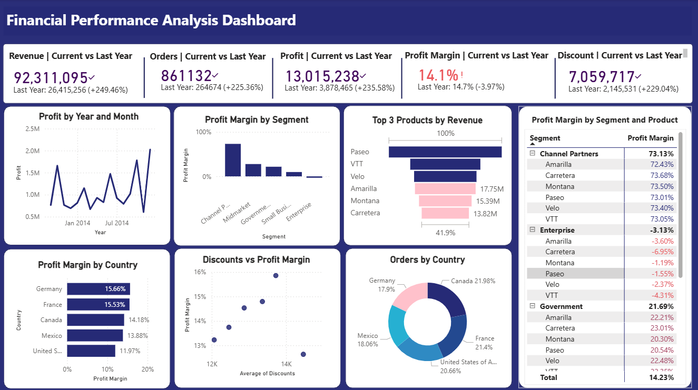

# 📊 Financial Performance Analysis Dashboard

Power BI dashboard for analyzing financial KPIs including revenue, profit, and profit margin across country, segment, and products.

---

## 📌 Project Objective

The objective of this dashboard was to analyze the financial performance of a company across different **countries**, **segments**, and **product categories**, and provide insights to help make better business decisions.

This project goes beyond simple visualization — it aims to **solve real-world business problems** by identifying patterns in **profitability**, **discounting strategy**, and **performance over time**.

---

## 🔍 Key Questions Addressed

- Which segments or countries are contributing most to total revenue and profit?
- How do discounts affect profit margin across different markets?
- Which areas are underperforming or generating losses?
- What is the year-over-year trend in total sales?

---

## 📈 Dashboard Features

- KPI cards for **Revenue**, **Profit**, and **Profit Margin**
- Line chart showing **Sales Trends over Time**
- Bar charts breaking down **Profit Margin by Segment & Country**
- Scatter chart analyzing **Discount vs. Profit Margin** impact
- Table view with **conditional formatting** to highlight negative margins
- Year-over-Year performance using **Time Intelligence (DAX)**

---

## 🛠️ Tools & Skills Used

- **Power BI Desktop**
- **DAX (Data Analysis Expressions)**  
  - e.g. `CALCULATE()`, `DATEADD()`, `IF()`, `DIVIDE()`, etc.
- **Power Query** for data transformation
- Data Modeling & Relationships
- Interactive visualizations with slicers & filters

---

## 📂 Dataset Source

- Dataset: `financials.xlsx`
- - Source: Publicly available **Financial Sample Dataset** from [Kaggle](https://www.kaggle.com/datasets/nibeditasahu/financial-sample-data)
- Purpose: Educational / Portfolio Project

---

## 🖼️ Dashboard Preview

---

## 🚀 How to Explore

1. Download the `.pbix` file from this repo  
2. Open it in **Power BI Desktop**  
3. Interact with filters and visuals to explore insights

---

## 📈 Next Steps

I plan to extend this project by:
- Applying forecasting techniques to project future revenue
- Connecting with a real-world retail or marketing dataset
- Creating a version with SQL + Power BI integration

---

## 🧠 What I Learned

- How to apply **Time Intelligence** in DAX to compare YoY performance
- How discounts can erode margins — even if sales volume is high
- Importance of conditional formatting to guide business decisions
- How to tell a story with financial data — not just display numbers

---

## 🤝 Let’s Connect

If you’re a recruiter, analyst, or fellow learner — feel free to connect with me on [LinkedIn](https://www.linkedin.com). I’d love to share ideas, get feedback, or collaborate!

